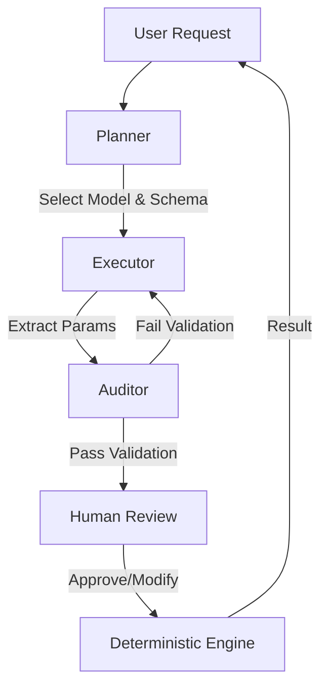

# AGENTS.md

## Overview
The **Neuro-Symbolic Valuation Engine** employs a multi-agent system to decouple semantic parameter extraction (Probalistic) from financial calculations (Deterministic). This document defines the personas, responsibilities, and interaction patterns of the agents.

## 1. The Planner (Orchestrator)
**Role**: System Architect & Router
- **Responsibility**:
    - Analyzes the user request (e.g., "Value Tesla").
    - Determines the industry sector and selects the appropriate valuation model (e.g., SaaS FCFF vs. Manufacturing DCF vs. Bank DDM).
    - Dispatch tasks to the Executor.
- **Tools**: None (Internal Logic).

## 2. The Executor (Parameter Hunter)
**Role**: Research Analyst
- **Responsibility**:
    - Scans financial documents (10-K, 10-Q, Transcripts).
    - Extracts specific parameters required by the selected model.
    - Provides "Citations" for every extracted value (Source + Quote).
- **Tools**: `RAGSearch`, `WebSearch`.

## 3. The Auditor (Compliance Officer)
**Role**: Risk Control & Quality Assurance
- **Responsibility**:
    - Validates the logical consistency of extracted parameters.
    - Enforces hard constraints (e.g., `terminal_growth_rate < GDP_growth`).
    - Flags "Hallucinations" or "Unrealistic Assumptions" for human review.
- **Input**: Structured JSON from Executor.
- **Output**: Validated JSON or Error Report.

## 4. The Human-in-the-Loop (Senior PM / Analyst)
**Role**: Final Decision Maker
- **Responsibility**:
    - Reviews the parameters prepared by the agents before calculation.
    - Adjusts assumptions based on intuition or external knowledge.
    - Resolves "Clean Surplus Violations" or audit flags.
- **Interaction**: Interruption via LangGraph before the `CalculationNode`.

---

## Interaction Flow

