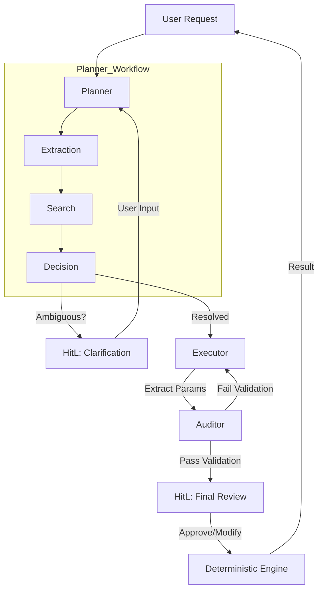

# AGENTS.md

## Overview
The **Neuro-Symbolic Valuation Engine** employs a multi-agent system to decouple semantic parameter extraction (Probabilistic) from financial calculations (Deterministic). This document defines the personas, responsibilities, and interaction patterns of the agents.

## 1. The Planner (Orchestrator)
**Role**: System Architect & Router
- **Responsibility**:
    - **Intent Extraction**: Parses user queries (e.g., "Value Tesla") to identify the company and potential model preference.
    - **Ticker Search**: Uses Yahoo Finance and Web Search to resolve the correct ticker symbol, handling ambiguity (e.g., "Google" -> GOOG/GOOGL).
    - **Model Selection**: Determines the industry sector and selects the appropriate valuation model (e.g., SaaS FCFF vs. Manufacturing DCF vs. Bank DDM).
    - **Clarification**: Detects ambiguity (e.g., multiple valid tickers) and requests human intervention before proceeding.
- **Tools**: `RAGSearch` (Internal), `WebSearch`, `YFinance`.

## 2. The Executor (Parameter Hunter)
**Role**: Research Analyst
- **Responsibility**:
    - Scans financial documents (10-K, 10-Q, Transcripts).
    - Extracts specific parameters required by the selected model.
    - Provides "Citations" for every extracted value (Source + Quote).
- **Tools**: `RAGSearch`, `WebSearch`.

## 3. The Auditor (Compliance Officer)
**Role**: Risk Control & Quality Assurance
- **Responsibility**:
    - Validates the logical consistency of extracted parameters.
    - Enforces hard constraints (e.g., `terminal_growth_rate < GDP_growth`).
    - Flags "Hallucinations" or "Unrealistic Assumptions" for human review.
- **Input**: Structured JSON from Executor.
- **Output**: Validated JSON or Error Report.

## 4. Human-in-the-Loop (HITL) Checkpoints

### A. Planner Clarification (Ambiguity Resolution)
**Role**: Disambiguation
- **Trigger**: Planner finds multiple valid tickers or is unsure about the model.
- **Action**: User selects the correct ticker/model or provides a new query.

### B. Final Review (Senior PM / Analyst)
**Role**: Final Decision Maker
- **Responsibility**:
    - Reviews the parameters prepared by the agents before calculation.
    - Adjusts assumptions based on intuition or external knowledge.
    - Resolves "Clean Surplus Violations" or audit flags.
- **Interaction**: Interruption via LangGraph before the `CalculationNode`.

---

## Interaction Flow

