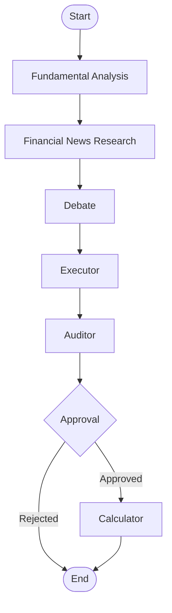

# Value Investment Agent (Neuro-Symbolic Valuation Engine)

The **Value Investment Agent** is a Neuro-Symbolic Valuation Engine that decouples semantic reasoning (Probabilistic) from financial calculations (Deterministic). It employs a multi-agent system to perform comprehensive fundamental analysis, extract financial parameters, and calculate intrinsic value using precise financial models.

## 🚀 Overview

Traditional LLM-based financial tools often hallucinate numbers or struggle with complex arithmetic. This project solves that by separating the "thinking" from the "math":
*   **Agents (Neuro)**: Understand user intent, research companies, analyze news, and extract specific valuation parameters from unstructured data (10-Ks, 10-Qs).
*   **Engine (Symbolic)**: A deterministic calculation layer that accepts validated parameters and executes financial models (e.g., DCF, DDM) with mathematical precision.

## 🧠 Neuro-Symbolic Architecture

The system is built on two core pillars:

### 1. Agents & Workflow (The "Graph")

The probabilistic side of the system is a **LangGraph** workflow that orchestrates specialized agents to gather, analyze, and validate data.



#### Agent Hierarchy

*   **`fundamental_analysis`** (Subgraph): Resolves the ticker, checks financial health, and selects the valuation model.
    *   `extraction`: Identifies user intent (company and desired model) from the query.
    *   `searching`: Performs dual-channel search (Yahoo Finance + Web) to find candidates.
    *   `deciding`: Logic to resolve ambiguity or request clarification.
    *   `financial_health`: Fetches XBRL data from SEC EDGAR and generates a health report.
    *   `model_selection`: Selects the appropriate valuation model (e.g., SaaS, Bank) based on industry.
    *   `clarifying`: Handles Human-in-the-Loop (HITL) interactions for ambiguity resolution.
*   **`financial_news_research`** (Subgraph): Gathers and analyzes market sentiment.
    *   `search_node`: Finds relevant news articles across multiple timeframes.
    *   `selector_node`: Filters articles for relevance using an LLM.
    *   `fetch_node`: Retrieves full text content for selected articles in parallel.
    *   `analyst_node`: Performs deep analysis on each article (Sentiment + Key Facts).
    *   `aggregator_node`: Synthesizes all analyses into a final sentiment score and summary.
*   **`debate`** (Subgraph): Challenges assumptions through multi-agent discourse.
    *   `debate_aggregator`: Prepares topics for debate based on research.
    *   `bull`: Argues for the investment case.
    *   `bear`: Argues against the investment case (risk focus).
    *   `moderator`: Evaluates arguments and decides the winner/conclusion.
*   **`executor`** (Node): The "Parameter Hunter". Scans financial documents to extract specific inputs required for the selected model.
*   **`auditor`** (Node): Validates extracted parameters against logical constraints and flags potential hallucinations.
*   **`approval`** (Node): A Human-in-the-Loop checkpoint where the user reviews and approves assumptions before calculation.
*   **`calculator`** (Node): The bridge to the deterministic engine.

### 2. Calculation Engine (The "Math")

The deterministic side is handled by the **`CalculationGraph`** (`src/engine/core.py`).

*   **Dependency Inference**: It automatically builds a Directed Acyclic Graph (DAG) by inspecting function signatures.
*   **Topological Execution**: Uses NetworkX to determine the correct order of operations, ensuring variable dependencies (e.g., `revenue` -> `ebit` -> `fcff`) are resolved before calculation.
*   **Traceability**: Every number is traceable back to its source (XBRL tag, formula, or user assumption).

## ✨ Key Features

### 📊 Valuation Models
Currently supported models:
*   **SaaS FCFF**: Free Cash Flow to Firm model tailored for Software-as-a-Service companies.
*   **Bank DDM**: Dividend Discount Model for valuing financial institutions.

## 🏗️ Architecture

*   **Frontend**: [Next.js 16](https://nextjs.org/), React 19, TypeScript.
*   **Backend**: Python, [FastAPI](https://fastapi.tiangolo.com/), [LangGraph](https://langchain-ai.github.io/langgraph/).
*   **Database**: PostgreSQL (for state persistence and checkpointing).
*   **Infrastructure**: Docker Compose.

## 🛠️ Getting Started

### Prerequisites
*   [Docker](https://www.docker.com/) and [Docker Compose](https://docs.docker.com/compose/)
*   An API key for [OpenRouter](https://openrouter.ai/) (to access LLMs like GPT-4, Claude, etc.)

### 1. Environment Setup
Create a `.env` file in the root directory:

```bash
touch .env
```

Add your OpenRouter API key and base URL:

```env
OPENROUTER_API_KEY=your_openrouter_api_key_here
OPENROUTER_BASE_URL=https://openrouter.ai/api/v1
# Optional: Database overrides (defaults provided in docker-compose)
# POSTGRES_USER=postgres
# POSTGRES_PASSWORD=postgres
# POSTGRES_DB=langgraph
```

### 2. Run with Docker (Recommended)
Build and start the entire stack:

```bash
docker-compose up --build
```

Access the application:
*   **Frontend**: [http://localhost:3000](http://localhost:3000)
*   **Backend API**: [http://localhost:8000](http://localhost:8000)
*   **API Documentation**: [http://localhost:8000/docs](http://localhost:8000/docs)

### 3. Manual Development (Optional)

#### Backend (`finance-agent-core`)
The backend uses `uv` for dependency management.

```bash
cd finance-agent-core
uv venv
source .venv/bin/activate
uv sync
uv run start
```
*   Run tests: `uv run pytest`

#### Frontend (`frontend`)
The frontend uses `npm`.

```bash
cd frontend
npm install
npm run dev
```

## 🧭 Development Guidelines
Backend contributor rules are documented at:

*   [`finance-agent-core/docs/development_guidelines.md`](finance-agent-core/docs/development_guidelines.md)

This guideline is mandatory for backend changes (typed contracts, boundary rules, no-compatibility policy, and validation checklist).

Cross-stack contract sync:

*   Run `bash scripts/generate-contracts.sh` after backend API contract changes.
*   Commit both generated files:
    *   `contracts/openapi.json`
    *   `frontend/src/types/generated/api-contract.ts`

## 🤝 Contributing
Contributions are welcome! Please follow the coding standards outlined in the project.
1.  Fork the repository.
2.  Create a feature branch.
3.  Commit your changes.
4.  Open a Pull Request.
