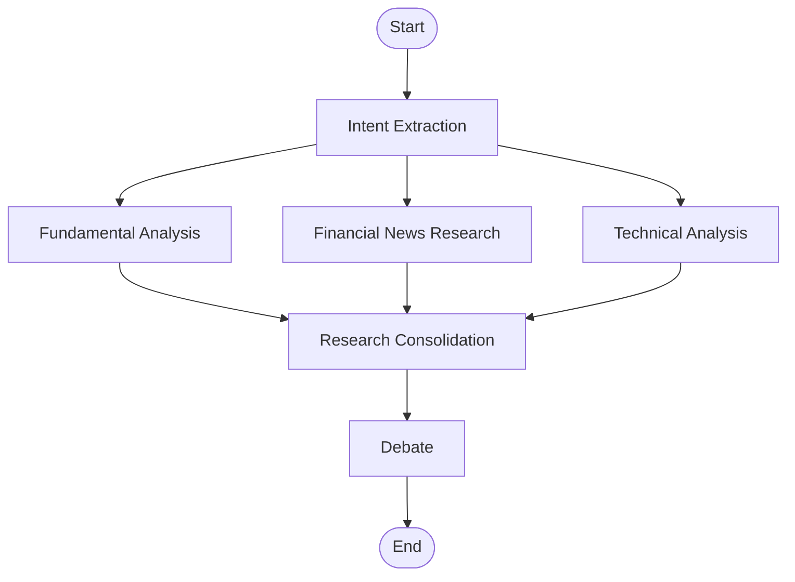

# Value Investment Agent (Neuro-Symbolic Valuation Engine)

The **Value Investment Agent** is a Neuro-Symbolic Valuation Engine that decouples semantic reasoning (Probabilistic) from financial calculations (Deterministic). It employs a multi-agent system to perform comprehensive fundamental analysis, extract financial parameters, and calculate intrinsic value using precise financial models.

## 🚀 Overview

Traditional LLM-based financial tools often hallucinate numbers or struggle with complex arithmetic. This project solves that by separating the "thinking" from the "math":
*   **Agents (Neuro)**: Understand user intent, research companies, analyze news, and extract specific valuation parameters from unstructured data (10-Ks, 10-Qs).
*   **Engine (Symbolic)**: A deterministic calculation layer that accepts validated parameters and executes financial models (e.g., DCF, DDM) with mathematical precision.

## 🧠 Neuro-Symbolic Architecture

The system is built on two core pillars:

### 1. Agents & Workflow (The "Graph")

The probabilistic side of the system is a **LangGraph** workflow that orchestrates specialized agents to gather, analyze, and validate data.


```mermaid
graph TD
    Start([Start]) --> Intent[Intent Extraction]
    Intent --> FA[Fundamental Analysis]
    Intent --> FNR[Financial News Research]
    Intent --> TA[Technical Analysis]

    FA --> Consolidate[Research Consolidation]
    FNR --> Consolidate
    TA --> Consolidate

    Consolidate --> Debate[Debate]
    Debate --> End([End])
```

#### Agent Hierarchy

*   **`intent_extraction`** (Subgraph): Identifies the user's intent, resolves ambiguity, and locks in the target company.
    *   `extraction`: Extracts company name, ticker, and analysis goals from the initial query.
    *   `searching`: Performs web or Yahoo Finance searches to find valid stock tickers if missing.
    *   `deciding`: Determines if the collected information is sufficient or if user clarification is needed.
    *   `clarifying`: Handles Human-in-the-Loop (HITL) interactions to resolve ambiguity with the user.
*   **`fundamental_analysis`** (Subgraph): Fetches financial data and computes intrinsic valuation.
    *   `financial_health`: Fetches XBRL data from SEC EDGAR and generates a baseline health report.
    *   `model_selection`: Selects the appropriate valuation model (e.g., SaaS, Bank) based on the company's industry profile.
    *   `calculation`: Bridges to the deterministic calculation engine to execute the selected financial model.
*   **`financial_news_research`** (Subgraph): Gathers and analyzes market sentiment in parallel.
    *   `search_node`: Finds relevant news articles across multiple timeframes.
    *   `selector_node`: Filters articles for relevance using an LLM.
    *   `fetch_node`: Retrieves full text content for selected articles in parallel.
    *   `analyst_node`: Performs deep analysis on each article (Sentiment + Key Facts).
    *   `aggregator_node`: Synthesizes all analyses into a final sentiment score and summary.
*   **`technical_analysis`** (Subgraph): Extracts technical indicators and price action features.
    *   `data_fetch`: Retrieves historical price and volume data.
    *   `fracdiff_compute`: Computes fractional differentiation and other quantitative momentum features.
    *   `semantic_translate`: Translates raw technical data into an LLM-readable narrative.
*   **`consolidate_research`** (Node): A synchronization point that aggregates output from Fundamental, News, and Technical agents into a unified context.
*   **`debate`** (Subgraph): Challenges assumptions through structured, multi-round agent discourse.
    *   `debate_aggregator`: Prepares topics and context for debate based on consolidated research.
    *   `fact_extractor`: Pulls out core, undisputed facts to ground the debate.
    *   `Round 1, 2, 3`: Iterative discourse involving a `bull` (arguing for), `bear` (arguing against), and a `moderator` (evaluating arguments).
    *   `verdict`: The final synthesized conclusion and investment recommendation.

### 2. Calculation Engine (The "Math")

The deterministic side is handled by the **`CalculationGraph`** (`src/agents/fundamental/subdomains/core_valuation/domain/engine/core.py`).

*   **Dependency Inference**: It automatically builds a Directed Acyclic Graph (DAG) by inspecting function signatures.
*   **Topological Execution**: Uses NetworkX to determine the correct order of operations, ensuring variable dependencies (e.g., `revenue` -> `ebit` -> `fcff`) are resolved before calculation.
*   **Traceability**: Every number is traceable back to its source (XBRL tag, formula, or user assumption).

## ✨ Key Features

### 📊 Valuation Models
Currently supported models:
*   **DCF Standard**: Standard Discounted Cash Flow.
*   **DCF Growth**: Discounted Cash Flow assuming a high-growth phase followed by stable growth.
*   **EV Multiple**: Enterprise Value Multiple valuation.
*   **EVA**: Economic Value Added model.
*   **REIT FFO**: Funds From Operations valuation tailored for Real Estate Investment Trusts.
*   **Residual Income**: Residual Income valuation model.
*   **SaaS FCFF**: Free Cash Flow to Firm model tailored for Software-as-a-Service companies.
*   **Bank DDM**: Dividend Discount Model for valuing financial institutions.

## 🏗️ Architecture

*   **Frontend**: [Next.js 16](https://nextjs.org/), React 19, TypeScript.
*   **Backend**: Python, [FastAPI](https://fastapi.tiangolo.com/), [LangGraph](https://langchain-ai.github.io/langgraph/). Structured using **Clean Architecture** and **Domain-Driven Design (DDD)** principles to ensure decoupling of core domain logic (e.g., valuation models) from infrastructure and application details.
*   **Database**: PostgreSQL (for state persistence and checkpointing).
*   **Infrastructure**: Docker Compose.

## 🛠️ Getting Started

### Prerequisites
*   [Docker](https://www.docker.com/) and [Docker Compose](https://docs.docker.com/compose/)
*   An API key for [OpenRouter](https://openrouter.ai/) (to access LLMs like GPT-4, Claude, etc.)

### 1. Environment Setup
Create a `.env` file in the root directory:

```bash
touch .env
```

Add your OpenRouter API key and base URL:

```env
OPENROUTER_API_KEY=your_openrouter_api_key_here
OPENROUTER_BASE_URL=https://openrouter.ai/api/v1
# Optional: Database overrides (defaults provided in docker-compose)
# POSTGRES_USER=postgres
# POSTGRES_PASSWORD=postgres
# POSTGRES_DB=langgraph
```

### 2. Run with Docker (Recommended)
Build and start the entire stack:

```bash
docker-compose up --build
```

Access the application:
*   **Frontend**: [http://localhost:3000](http://localhost:3000)
*   **Backend API**: [http://localhost:8000](http://localhost:8000)
*   **API Documentation**: [http://localhost:8000/docs](http://localhost:8000/docs)

### 3. Manual Development (Optional)

#### Backend (`finance-agent-core`)
The backend uses `uv` for dependency management.

```bash
cd finance-agent-core
uv venv
source .venv/bin/activate
uv sync
uv run start
```
*   Run tests: `uv run pytest`

#### Frontend (`frontend`)
The frontend uses `npm`.

```bash
cd frontend
npm install
npm run dev
```

## 🧭 Development Guidelines
Authoritative engineering guidelines (mandatory):

*   [`docs/README.md`](docs/README.md) (document authority index)
*   [`docs/clean-architecture-engineering-guideline.md`](docs/clean-architecture-engineering-guideline.md)
*   [`docs/backend-guideline.md`](docs/backend-guideline.md)
*   [`docs/frontend-guideline.md`](docs/frontend-guideline.md)
*   [`docs/agent-layer-responsibility-and-naming-guideline.md`](docs/agent-layer-responsibility-and-naming-guideline.md)
*   [`docs/fundamental-reference-architecture.md`](docs/fundamental-reference-architecture.md) (reference implementation)

Cross-stack contract sync:

*   Run `bash scripts/generate-contracts.sh` after backend API contract changes.
*   Commit both generated files:
    *   `contracts/openapi.json`
    *   `frontend/src/types/generated/api-contract.ts`

Additional audit/history references (non-normative):

*   `docs/fullstack-change-control-playbook.md`
*   `docs/clean-architecture-agent-workflow-blueprint.md`
*   `docs/agent-cross-review-2026-02-13.md`

## 🤝 Contributing
Contributions are welcome! Please follow the coding standards outlined in the project.
1.  Fork the repository.
2.  Create a feature branch.
3.  Commit your changes.
4.  Open a Pull Request.
