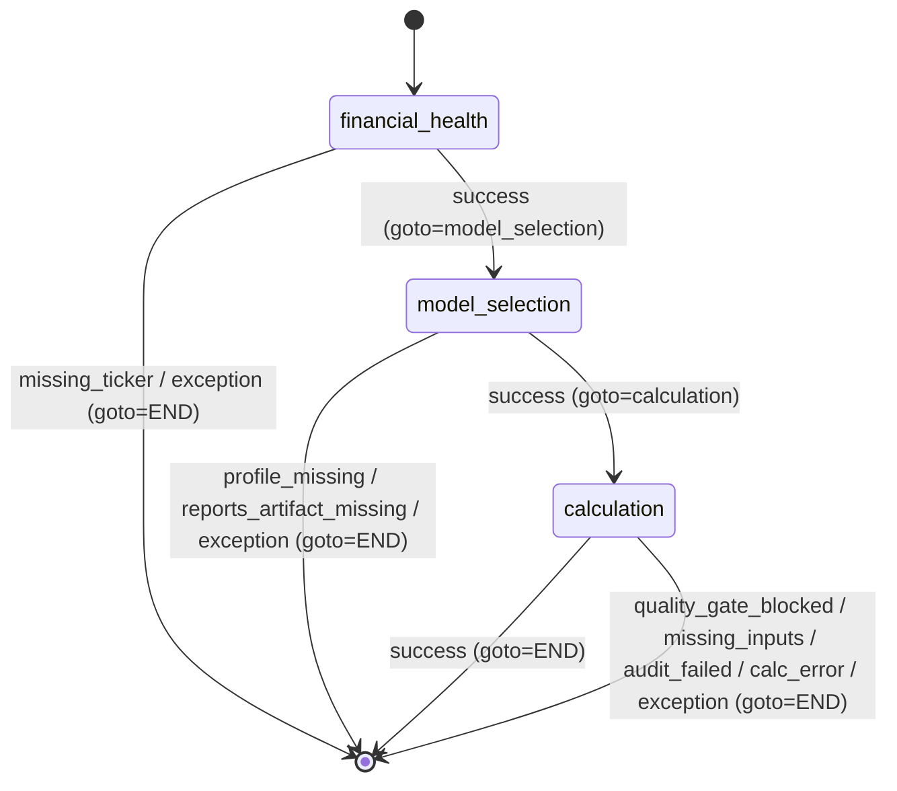

# Agent Deep Dive: fundamental

## Architecture and State

### Package tree (concise)

```text
finance-agent-core/src/agents/fundamental/
├── subgraph.py
├── wiring.py
├── artifacts_provenance/
├── core_valuation/
│   └── domain/
│       ├── valuation_model_registry.py
│       ├── parameterization/
│       ├── policies/
│       ├── calculators/
│       └── models/
├── financial_statements/
├── forward_signals/
├── market_data/
├── model_selection/
│   ├── domain/
│   │   ├── model_selection.py
│   │   └── model_selection_*.py
│   └── interface/report_projection_service.py
├── shared/contracts/traceable.py
├── workflow_orchestrator/
│   ├── application/
│   │   ├── factory.py
│   │   ├── orchestrator.py
│   │   ├── ports.py
│   │   ├── state_readers.py
│   │   ├── state_updates.py
│   │   ├── financial_health_flow.py
│   │   ├── model_selection_flow.py
│   │   ├── valuation_flow.py
│   │   └── services/
│   └── interface/mappers.py
└── interface/
    ├── contracts.py
    ├── parsers.py
    ├── serializers.py
    └── preview_projection_service.py
```

- [Observed] 以上分層與目錄存在。Evidence: `finance-agent-core/src/agents/fundamental` 目錄掃描結果；`finance-agent-core/src/agents/fundamental/workflow_orchestrator/application/factory.py:1`, `finance-agent-core/src/agents/fundamental/model_selection/domain/model_selection.py:1`, `finance-agent-core/src/agents/fundamental/financial_statements/infrastructure/sec_xbrl/provider.py:1`, `finance-agent-core/src/agents/fundamental/interface/contracts.py:1`

### Layer ownership and import direction

- [Observed] Workflow node 只做轉接，真正邏輯在 `workflow_orchestrator` runner/flow。Evidence: `finance-agent-core/src/workflow/nodes/fundamental_analysis/nodes.py:10-25`
- [Observed] `workflow_orchestrator/application` 封裝 orchestration/flow，並注入子域依賴。Evidence: `finance-agent-core/src/agents/fundamental/workflow_orchestrator/application/factory.py:85-97`, `finance-agent-core/src/agents/fundamental/workflow_orchestrator/application/factory.py:121-180`
- [Observed] `core_valuation`/`model_selection` domain 負責 valuation param/calc/audit 與選模規則。Evidence: `finance-agent-core/src/agents/fundamental/model_selection/domain/model_selection.py:45-87`, `finance-agent-core/src/agents/fundamental/core_valuation/domain/valuation_model_registry.py:34-85`, `finance-agent-core/src/agents/fundamental/core_valuation/domain/parameterization/orchestrator.py:72-139`
- [Observed] 各子域 `infrastructure` 實作 SEC XBRL、market data、artifact repo。Evidence: `finance-agent-core/src/agents/fundamental/wiring.py:9-17`, `finance-agent-core/src/agents/fundamental/financial_statements/infrastructure/sec_xbrl/provider.py:44-63`, `finance-agent-core/src/agents/fundamental/market_data/infrastructure/market_data_service.py:120-140`, `finance-agent-core/src/agents/fundamental/artifacts_provenance/infrastructure/fundamental_artifact_repository.py:23-94`
- [Observed] `interface` 提供 payload 合約、parser、serializer；`workflow_orchestrator/interface` 提供 preview mapper。Evidence: `finance-agent-core/src/agents/fundamental/interface/contracts.py:68-405`, `finance-agent-core/src/agents/fundamental/financial_statements/interface/parsers.py:75-142`, `finance-agent-core/src/agents/fundamental/interface/serializers.py:47-186`, `finance-agent-core/src/agents/fundamental/workflow_orchestrator/interface/mappers.py:11-19`

### State payload and key contracts

- [Observed] 子圖輸入來自 `intent_extraction` 與既有 `fundamental_analysis` context。Evidence: `finance-agent-core/src/workflow/nodes/fundamental_analysis/subgraph_state.py:29-31`
- [Observed] 子圖輸出為 `fundamental_analysis/messages/node_statuses/error_logs`。Evidence: `finance-agent-core/src/workflow/nodes/fundamental_analysis/subgraph_state.py:33-43`
- [Observed] `read_intent_state` 讀取 `resolved_ticker`/`company_profile`；`read_fundamental_state` 讀取 `model_type`/`financial_reports_artifact_id`。Evidence: `finance-agent-core/src/agents/fundamental/workflow_orchestrator/application/state_readers.py:40-69`
- [Observed] financial health payload contract 強制四個鍵：`financial_reports/forward_signals/diagnostics/quality_gates`。Evidence: `finance-agent-core/src/agents/fundamental/financial_statements/interface/parsers.py:83-112`
- [Observed] valuation context contract 需 `model_type + reports_artifact_id + reports_raw + model_runtime`。Evidence: `finance-agent-core/src/agents/fundamental/workflow_orchestrator/application/services/valuation_execution_context_service.py:25-80`
- [Observed] Traceable/Provenance contract 在 interface/domain 兩側都有強制。Evidence: `finance-agent-core/src/agents/fundamental/interface/contracts.py:68-97`, `finance-agent-core/src/agents/fundamental/core_valuation/domain/report_contract.py:283-375`

## Workflow Graph



- [Observed] 子圖節點註冊為 `financial_health -> model_selection -> calculation`。Evidence: `finance-agent-core/src/agents/fundamental/subgraph.py:27-50`
- [Observed] node wrapper 以 `command_from_result` 使用 use case 回傳的 `goto` 進行路由。Evidence: `finance-agent-core/src/workflow/nodes/fundamental_analysis/nodes.py:10-25`, `finance-agent-core/src/workflow/command_adapter.py:23-27`
- [Observed] `financial_health` 成功 goto `model_selection`，錯誤 goto `END`。Evidence: `finance-agent-core/src/agents/fundamental/workflow_orchestrator/application/financial_health_flow.py:160-170`, `finance-agent-core/src/agents/fundamental/workflow_orchestrator/application/financial_health_flow.py:194-200`
- [Observed] `model_selection` 成功 goto `calculation`，缺 profile/缺 artifact/例外 goto `END`。Evidence: `finance-agent-core/src/agents/fundamental/workflow_orchestrator/application/model_selection_flow.py:97-100`, `finance-agent-core/src/agents/fundamental/workflow_orchestrator/application/model_selection_flow.py:136-145`, `finance-agent-core/src/agents/fundamental/workflow_orchestrator/application/model_selection_flow.py:263-268`, `finance-agent-core/src/agents/fundamental/workflow_orchestrator/application/model_selection_flow.py:291-297`
- [Observed] `calculation` 各種分支都收斂到 `END`。Evidence: `finance-agent-core/src/agents/fundamental/workflow_orchestrator/application/valuation_flow.py:1528-1531`, `finance-agent-core/src/agents/fundamental/workflow_orchestrator/application/valuation_flow.py:1617-1624`, `finance-agent-core/src/agents/fundamental/workflow_orchestrator/application/valuation_flow.py:1655-1660`, `finance-agent-core/src/agents/fundamental/workflow_orchestrator/application/valuation_flow.py:1711-1716`, `finance-agent-core/src/agents/fundamental/workflow_orchestrator/application/valuation_flow.py:1850`, `finance-agent-core/src/agents/fundamental/workflow_orchestrator/application/valuation_flow.py:1871-1874`
- [Observed] No conditional edges observed（在 graph builder 層只有 `add_edge`，沒有 `add_conditional_edges`）。Evidence: `finance-agent-core/src/agents/fundamental/subgraph.py:48-50`

## Implementation Deep Dive (Tool-Action-Result)

### Application layer (流程主軸)

#### 1) `financial_health` 流程

- [Observed] Tool/Technique: `asyncio.to_thread`
  Action: 把同步 `fetch_financial_data_fn` 丟到 thread 執行。
  Result: 避免阻塞 async workflow。Evidence: `finance-agent-core/src/agents/fundamental/workflow_orchestrator/application/financial_health_flow.py:83-86`
- [Observed] Tool/Technique: `parse_financial_health_payload`
  Action: 驗證 + canonicalize financial payload。
  Result: 後續流程只處理型別一致的 reports/signals/diagnostics。Evidence: `finance-agent-core/src/agents/fundamental/workflow_orchestrator/application/factory.py:110-119`, `finance-agent-core/src/agents/fundamental/financial_statements/interface/parsers.py:75-112`
- [Observed] Tool/Technique: Artifact repository port
  Action: 儲存 `financial_reports + forward_signals + diagnostics + quality_gates`。
  Result: state 只保留 `financial_reports_artifact_id`，避免大 payload 進 state。Evidence: `finance-agent-core/src/agents/fundamental/workflow_orchestrator/application/financial_health_flow.py:95-106`, `finance-agent-core/src/agents/fundamental/workflow_orchestrator/application/state_updates.py:28-39`
- [Observed] Tool/Technique: preview mapper/serializer
  Action: `build_fundamental_app_context -> summarize_preview -> build_progress_artifact`。
  Result: 產生進度 artifact 給 UI/後續節點。Evidence: `finance-agent-core/src/agents/fundamental/workflow_orchestrator/application/financial_health_flow.py:107-116`, `finance-agent-core/src/agents/fundamental/workflow_orchestrator/application/factory.py:48-83`

#### 2) `model_selection` 流程

- [Observed] Tool/Technique: artifact bundle loader
  Action: 從 artifact id 載入 `financial_reports + forward_signals`。
  Result: 不需要在 workflow state 傳 raw reports。Evidence: `finance-agent-core/src/agents/fundamental/workflow_orchestrator/application/model_selection_flow.py:107-150`, `finance-agent-core/src/agents/fundamental/artifacts_provenance/infrastructure/fundamental_artifact_repository.py:70-85`
- [Observed] Tool/Technique: report projector
  Action: canonical report -> `FundamentalSelectionReport`。
  Result: domain scoring 使用乾淨、固定欄位。Evidence: `finance-agent-core/src/agents/fundamental/workflow_orchestrator/application/model_selection_flow.py:147`, `finance-agent-core/src/agents/fundamental/model_selection/interface/report_projection_service.py:50-81`
- [Observed] Tool/Technique: deterministic model scoring
  Action: `collect_selection_signals -> evaluate_model_spec -> ranking -> reasoning`。
  Result: 選出 valuation model 並給可解釋原因。Evidence: `finance-agent-core/src/agents/fundamental/model_selection/domain/model_selection.py:52-87`, `finance-agent-core/src/agents/fundamental/model_selection/domain/model_selection_signal_service.py:10-55`, `finance-agent-core/src/agents/fundamental/model_selection/domain/model_selection_scoring_service.py:12-80`
- [Observed] Tool/Technique: model type resolver + artifact writer
  Action: `selected_model` 映射到 calculator `model_type`，並寫入完整 report artifact。
  Result: calculation 階段拿到可執行 model_type + reports artifact id。Evidence: `finance-agent-core/src/agents/fundamental/workflow_orchestrator/application/model_selection_flow.py:161-176`, `finance-agent-core/src/agents/fundamental/core_valuation/domain/valuation_model_type_service.py:6-10`, `finance-agent-core/src/agents/fundamental/workflow_orchestrator/application/services/model_selection_artifact_service.py:101-124`

#### 3) `calculation` 流程

- [Observed] Tool/Technique: execution context resolver
  Action: 驗證 `model_type`、載入 runtime(schema/calculator/auditor)、拉 reports bundle。
  Result: 缺欄位或 artifact 時立即 fail-fast。Evidence: `finance-agent-core/src/agents/fundamental/workflow_orchestrator/application/services/valuation_execution_context_service.py:51-70`
- [Observed] Tool/Technique: semaphore + `asyncio.to_thread`
  Action: 計算階段限制同時 thread 計算數量。
  Result: 控制 CPU 競爭與延遲尖峰。Evidence: `finance-agent-core/src/agents/fundamental/workflow_orchestrator/application/valuation_flow.py:38-40`, `finance-agent-core/src/agents/fundamental/workflow_orchestrator/application/valuation_flow.py:89-105`
- [Observed] Tool/Technique: quality gate + missing-input policy
  Action: 先檢查 XBRL quality gate，再對 missing metrics 套 warn/block policy。
  Result: 阻斷高風險輸入、降低非關鍵缺值造成硬失敗。Evidence: `finance-agent-core/src/agents/fundamental/workflow_orchestrator/application/valuation_flow.py:1485-1531`, `finance-agent-core/src/agents/fundamental/workflow_orchestrator/application/valuation_flow.py:1384-1447`
- [Observed] Tool/Technique: valuation runtime registry
  Action: 依 model_type 取 schema/calculator/auditor，先 audit 再 calculator。
  Result: 保持 deterministic 計算與參數審核。Evidence: `finance-agent-core/src/agents/fundamental/core_valuation/domain/valuation_model_registry.py:35-85`, `finance-agent-core/src/agents/fundamental/workflow_orchestrator/application/services/valuation_execution_result_service.py:90-141`
- [Observed] Tool/Technique: update/preview/snapshot artifact pipeline
  Action: 建立 success update、寫 valuation replay artifact、回寫 artifact reference。
  Result: 前台可讀 preview，後台可重播估值。Evidence: `finance-agent-core/src/agents/fundamental/workflow_orchestrator/application/valuation_flow.py:1794-1825`, `finance-agent-core/src/agents/fundamental/workflow_orchestrator/application/valuation_flow.py:1208-1234`, `finance-agent-core/src/agents/fundamental/workflow_orchestrator/application/valuation_flow.py:1277-1313`

### Infrastructure layer (clients/tools)

- [Observed] Tool/Client: SEC `edgar` (`Company`, `configure_http`, `set_identity`)
  Action: 初始化 SEC client，抓 10-K/XBRL/filing text。
  Result: financial health 與 text forward signals 的主要上游資料。Evidence: `finance-agent-core/src/agents/fundamental/financial_statements/infrastructure/sec_xbrl/extractor.py:7`, `finance-agent-core/src/agents/fundamental/financial_statements/infrastructure/sec_xbrl/extractor.py:80-94`, `finance-agent-core/src/agents/fundamental/financial_statements/infrastructure/sec_xbrl/sec_identity_service.py:6-40`, `finance-agent-core/src/agents/fundamental/financial_statements/infrastructure/sec_xbrl/text_signal_record_loader_service.py:19-40`
- [Observed] Tool/Client: Arelle engine
  Action: 當 primary XBRL facts schema 不可用時，走 Arelle attachment parse。
  Result: Arelle-first fallback，並輸出 validation/runtime metadata。Evidence: `finance-agent-core/src/agents/fundamental/financial_statements/infrastructure/sec_xbrl/extractor.py:314-365`, `finance-agent-core/src/agents/fundamental/financial_statements/infrastructure/sec_xbrl/extractor.py:397-417`, `finance-agent-core/src/agents/fundamental/financial_statements/infrastructure/sec_xbrl/providers/arelle_engine.py:100-208`
- [Observed] Tool/Client: market data providers (`yfinance`, `FRED API`, free web parsers)
  Action: 聚合 `current_price/risk_free_rate/beta/target_mean_price/...`。
  Result: valuation parameterization 可用 market snapshot。Evidence: `finance-agent-core/src/agents/fundamental/market_data/infrastructure/market_data_service.py:133-140`, `finance-agent-core/src/agents/fundamental/market_data/infrastructure/yahoo_finance_provider.py:6`, `finance-agent-core/src/agents/fundamental/market_data/infrastructure/fred_macro_provider.py:108-112`, `finance-agent-core/src/agents/fundamental/market_data/infrastructure/tipranks_provider.py:22-25`, `finance-agent-core/src/agents/fundamental/market_data/infrastructure/investing_provider.py:24-26`, `finance-agent-core/src/agents/fundamental/market_data/infrastructure/marketbeat_provider.py:24-26`
- [Observed] Tool/Client: `requests` + `urllib3.Retry`
  Action: free consensus parser 統一 HTTP retry/backoff/status_forcelist。
  Result: 目標價爬取抗暫時網路錯誤。Evidence: `finance-agent-core/src/agents/fundamental/market_data/infrastructure/free_consensus_web_parser.py:186-200`
- [Observed] Tool/Client: `TypedArtifactPort` + `artifact_manager`
  Action: financial_reports/snapshots 存取統一 through artifact port。
  Result: state 輕量化、跨節點資料可重用。Evidence: `finance-agent-core/src/agents/fundamental/artifacts_provenance/infrastructure/fundamental_artifact_repository.py:23-94`

### Domain layer (policies/math)

- [Observed] Tool/Technique: model spec catalog + scoring weights
  Action: sector/industry/SIC/profitability/data coverage 打分。
  Result: deterministic model selection。Evidence: `finance-agent-core/src/agents/fundamental/model_selection/domain/model_selection_spec_catalog.py:6-110`, `finance-agent-core/src/agents/fundamental/model_selection/domain/model_selection_scoring_service.py:12-80`
- [Observed] Tool/Technique: parameterization orchestrator
  Action: parse reports -> model builder -> time-alignment guard -> forward-signal adjustment。
  Result: 產生 `ParamBuildResult(params/trace_inputs/missing/assumptions/metadata)`。Evidence: `finance-agent-core/src/agents/fundamental/core_valuation/domain/parameterization/orchestrator.py:72-139`
- [Observed] Tool/Technique: model builder registry
  Action: 不同 model_type 映射到 payload builder/context/result assembly。
  Result: 同一入口支援 DCF/EV/Bank/REIT/Residual/EVA。Evidence: `finance-agent-core/src/agents/fundamental/core_valuation/domain/parameterization/registry_service.py:265-353`
- [Observed] Tool/Technique: forward-signal policy + calibration
  Action: parse signal schema、confidence/metric 篩選、basis points 校準、series adjust。
  Result: 對 growth/margin series 做受控調整並保留 metadata。Evidence: `finance-agent-core/src/agents/fundamental/core_valuation/domain/policies/forward_signal_parser_service.py:16-73`, `finance-agent-core/src/agents/fundamental/core_valuation/domain/policies/forward_signal_scoring_service.py:20-214`, `finance-agent-core/src/agents/fundamental/core_valuation/domain/parameterization/forward_signal_adjustment_service.py:24-148`, `finance-agent-core/src/agents/fundamental/core_valuation/domain/parameterization/forward_signal_calibration_mapping_service.py:33-86`

## LLM and Prompt Strategy

- [Observed] 在 `fundamental` agent 主流程中，未看到 LLM prompt template 或 `with_structured_output` 呼叫；主流程是 parser + deterministic policy + calculator。Evidence: `finance-agent-core/src/agents/fundamental/workflow_orchestrator/application/financial_health_flow.py:42-200`, `finance-agent-core/src/agents/fundamental/workflow_orchestrator/application/model_selection_flow.py:55-297`, `finance-agent-core/src/agents/fundamental/workflow_orchestrator/application/valuation_flow.py:1461-1874`
- [Observed] repository 全域搜尋 `with_structured_output|ChatOpenAI|PromptTemplate|llm` 在 fundamental 內未命中 prompt runtime；唯一 `langchain_*` 命中是 text splitter。Evidence: `finance-agent-core/src/agents/fundamental/financial_statements/infrastructure/sec_xbrl/sentence_pipeline.py:161`
- [Observed] text forward-signal pipeline 採規則/檢索/FinBERT direction review，不是生成式 prompt。Evidence: `finance-agent-core/src/agents/fundamental/financial_statements/infrastructure/sec_xbrl/forward_signals_text.py:15-22`, `finance-agent-core/src/agents/fundamental/financial_statements/infrastructure/sec_xbrl/forward_signals_text.py:276-282`, `finance-agent-core/src/agents/fundamental/financial_statements/infrastructure/sec_xbrl/finbert_direction.py:39-165`
- [Observed] 未在此模組觀察到「Prompt construction strategy / structured output parser for LLM」。未在代碼中觀察到。

## External Dependencies and Cross-Agent Boundaries

### Upstream and downstream boundaries

- [Observed] 上游來自 `intent_agent`，fundamental 子圖吃 `intent_extraction` context。Evidence: `finance-agent-core/src/workflow/graph.py:75-80`, `finance-agent-core/src/workflow/nodes/fundamental_analysis/subgraph_state.py:29-31`
- [Observed] fundamental 輸出 `financial_reports_artifact_id` 與 `artifact.preview`，下游 debate 讀取這兩者。Evidence: `finance-agent-core/src/agents/fundamental/workflow_orchestrator/application/state_updates.py:28-39`, `finance-agent-core/src/agents/debate/application/debate_context.py:71-92`
- [Observed] parent workflow 中 fundamental/news/technical 並行，之後才 consolidate -> debate。Evidence: `finance-agent-core/src/workflow/graph.py:78-90`

### External dependencies

- [Observed] SEC/EDGAR client: `edgar`。Evidence: `finance-agent-core/src/agents/fundamental/financial_statements/infrastructure/sec_xbrl/extractor.py:7`, `finance-agent-core/src/agents/fundamental/financial_statements/infrastructure/sec_xbrl/sec_identity_service.py:6-7`
- [Observed] Arelle runtime: optional but在 fallback 路徑為 required。Evidence: `finance-agent-core/src/agents/fundamental/financial_statements/infrastructure/sec_xbrl/providers/arelle_engine.py:107-110`, `finance-agent-core/src/agents/fundamental/financial_statements/infrastructure/sec_xbrl/extractor.py:416-430`
- [Observed] Yahoo data client: `yfinance`。Evidence: `finance-agent-core/src/agents/fundamental/market_data/infrastructure/yahoo_finance_provider.py:6`
- [Observed] FRED HTTP API: `urllib.request.urlopen`。Evidence: `finance-agent-core/src/agents/fundamental/market_data/infrastructure/fred_macro_provider.py:110-112`
- [Observed] Free web consensus scraping: `requests`。Evidence: `finance-agent-core/src/agents/fundamental/market_data/infrastructure/free_consensus_web_parser.py:9-13`, `finance-agent-core/src/agents/fundamental/market_data/infrastructure/free_consensus_web_parser.py:50-55`

## Deviations, Risks, and Unknowns

- [Observed] 與 AGENTS 文檔中 Strategist 節點（`extraction/searching/deciding/clarifying`）相比，當前 fundamental 子圖只有 3 個節點（`financial_health/model_selection/calculation`）。Evidence: `finance-agent-core/src/agents/fundamental/subgraph.py:27-50`
- [Observed] 子圖在 `agents/fundamental/subgraph.py` 反向 import `workflow/nodes/fundamental_analysis/*`，出現 agent 層依賴 workflow 層。Evidence: `finance-agent-core/src/agents/fundamental/subgraph.py:8-17`
- [Observed] 未找到 HITL approval gate（valuation 前暫停等人工批准）的實作；calculation 直接在成功 model_selection 後執行。Evidence: `finance-agent-core/src/agents/fundamental/workflow_orchestrator/application/model_selection_flow.py:263-268`, `finance-agent-core/src/agents/fundamental/workflow_orchestrator/application/valuation_flow.py:1461-1479`
- [Observed] `valuation_flow.py` 單檔超長（~1800 行），流程耦合度高，測試與變更風險較高。Evidence: `finance-agent-core/src/agents/fundamental/workflow_orchestrator/application/valuation_flow.py:1-1874`
- [Observed] free web consensus 來源受站點阻擋/限流/解析變動影響，雖有 fallback 但可能降級到單一來源。Evidence: `finance-agent-core/src/agents/fundamental/market_data/infrastructure/free_consensus_web_parser.py:55-80`, `finance-agent-core/src/agents/fundamental/market_data/infrastructure/market_data_service.py:522-535`
- [Observed] FRED 缺 API key 時直接輸出 missing datum，可能影響 risk_free_rate/long_run_growth_anchor 品質。Evidence: `finance-agent-core/src/agents/fundamental/market_data/infrastructure/fred_macro_provider.py:84-97`
- [Observed] market data 會在缺值時 default `beta=1.0`、`risk_free_rate=4.2%`，有助可用性但會引入估值偏移風險。Evidence: `finance-agent-core/src/agents/fundamental/market_data/infrastructure/market_data_service.py:239-257`, `finance-agent-core/src/agents/fundamental/market_data/infrastructure/market_data_service.py:421-458`
- [Inferred] 若要完全對齊 Neuro-Symbolic 設計敘述，應把目前 workflow 層-代理層邊界再收斂（例如把 subgraph node adapter 放在 workflow 層，agent 僅暴露 runner/port）。Evidence: `finance-agent-core/src/agents/fundamental/subgraph.py:8-17`, `finance-agent-core/src/workflow/nodes/fundamental_analysis/nodes.py:4-25`
- [Observed] 某些高階能力（例如「模型選擇前 clarifying 對話」）未在此模組觀察到。未在代碼中觀察到。
