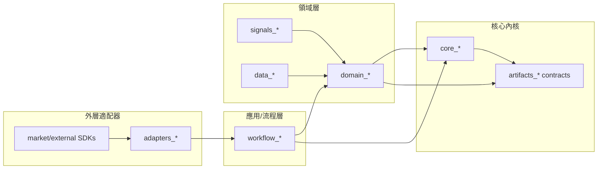
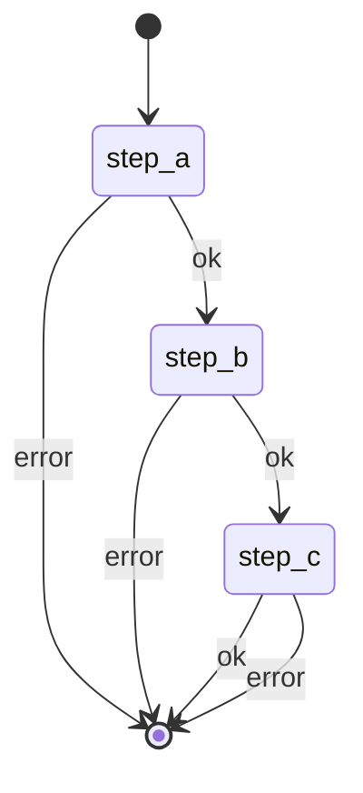

# 重構經驗提煉：從單體流程到領域模組化

## 目的

建立一份可重複使用的重構參考：把「膨脹的流程型模組」拆解成可獨立演進的領域模組，並以薄編排層串接流程。此文檔可作為後續其他模組重構的通用指南，不限定於某一個子系統。

## 要解決的問題

1. **流程膨脹**：長 use case 或 orchestrator 持續吸納職責，導致檔案巨大、改動風險高。
2. **邊界模糊**：領域邏輯與外部依賴混雜，無法形成穩定的內核。
3. **耦合過高**：新增功能必須改動流程主線，影響回歸測試與交付節奏。
4. **可測性差**：測試只能走大流程，無法針對子能力做快速單元驗證。

## 核心概念

### 1) 以「領域功能」作為主拆分軸

優先以穩定概念拆分：資料處理、信號處理、模型選擇、計算引擎、對外依賴適配、追溯/存檔等。這些子域應在結構上獨立，具備清晰輸入/輸出契約。

### 2) 流程拆分作為第二層

流程層只負責串接，不承擔細節業務邏輯。它的功能是：

- 依序調用子域能力
- 協調錯誤處理與狀態流轉
- 組織回傳結果與進度狀態

### 3) 依賴方向固定：內核不依賴外部

核心領域模組只依賴內部契約；外部 API、資料庫、爬取等細節被封裝在外層 adapter 並透過 ports/clients 注入。

### 4) 可替換性是一等目標

將「產品/模型/數值方法」分離，確保新增新模型或策略不會破壞既有核心流程。

## 拆分方法（通用模板）

### 目標分層

- `core_*`：穩定內核（模型、計算、審計、核心規則）
- `domain_*`：領域規則（選擇、評分、規則引擎、策略）
- `data_*`：資料解析與 canonicalization
- `signals_*`：信號抽取、校準、政策與 guardrails
- `adapters_*`：外部依賴（API/SDK/爬取）
- `artifacts_*`：追溯存檔、版本化、快照
- `workflow_*`：流程編排與錯誤控制

### 拆分步驟

1. **盤點流程責任**：列出流程中每一步的「輸入/輸出/副作用」。
2. **抽出穩定概念**：將高變動外部依賴與低變動核心規則分離。
3. **建立子域契約**：定義每個子域的輸入/輸出資料結構與錯誤策略。
4. **削薄 orchestrator**：把細節邏輯下放，流程層只串接。
5. **封裝外部依賴**：以 ports/clients 隔離 SDK/API；內核只看抽象。
6. **建立回歸策略**：先保留原流程，逐步切換到新模組，確保可回退。

## 注意事項（通用）

1. **不要用流程當主拆分軸**
   流程應該是薄的一層 orchestrator；當流程承載業務邏輯，模組會迅速膨脹。

2. **不要讓內核依賴爬蟲或外部 SDK**
   這會讓核心不可測試且演進困難；外部依賴一定要在外層 adapter。

3. **每個子域要有可觀測輸出**
   子域必須輸出明確的結果（或錯誤）結構，方便監控與追蹤。

4. **保持契約穩定，實現可替換**
   輸入/輸出資料結構穩定可讓策略、模型、來源可替換。

5. **確保測試可獨立運行**
   每個子域至少有單元測試，流程層只做最小整合測試。

## 成功判斷標準

- 主要 use case 檔案縮小（責任下降）
- 新模型/新策略添加只改動對應子域
- 外部依賴替換不影響內核
- 測試可在子域層快速完成
- 流程層行為可被簡單驗證（狀態轉移/錯誤路徑）

## 可複用的產出

- 子域責任矩陣（輸入/輸出/副作用）
- 依賴方向圖（內核 vs 外層）
- 流程編排圖（僅顯示 orchestrator）
- 模型/策略註冊表（可替換性）

## 可複用模板

### 1) 依賴方向圖（模板）

重點：依賴只能向內指向；外層永遠不被內核依賴。

### 2) 子域責任矩陣（模板）

| 子域 | 主要責任 | 輸入 | 輸出 | 副作用 | 依賴 |
| --- | --- | --- | --- | --- | --- |
| `core_*` | 核心計算/模型/審計 | 參數、報表快照 | 結果、審計報告 | 無 | 內部契約 |
| `domain_*` | 規則、評分、策略 | 報表/信號 | 決策/解釋 | 無 | `core_*` |
| `data_*` | 解析/清洗/統一格式 | 原始數據 | canonical data | 有 | 外部數據 |
| `signals_*` | 信號抽取/校準 | 文本/數據 | 信號序列 | 有 | 外部數據 |
| `adapters_*` | 外部 API/SDK/爬取 | 外部資源 | 內部可用數據 | 有 | 外部服務 |
| `artifacts_*` | 存檔/追溯/版本化 | 任意輸出 | artifact id | 有 | 存儲 |
| `workflow_*` | 流程串接/錯誤控制 | 子域輸出 | 狀態/進度 | 有 | `domain_*`, `core_*` |

### 3) 流程編排圖（模板）

重點：流程層只承擔狀態轉移與錯誤邏輯，不承擔領域細節。
