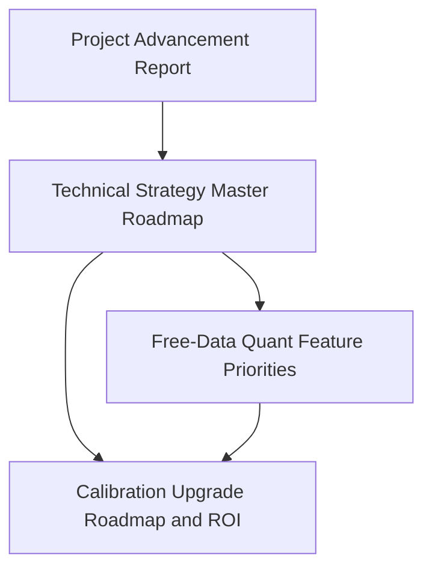

# RFC: Technical Strategy Master Roadmap

Date: 2026-03-19
Status: Draft
Owner: Codex working notes for project direction alignment

## Purpose

This document is the **master entry point** for the current technical-strategy RFC set.

It exists to prevent confusion across multiple planning documents by making three things explicit:

1. what the current strategic direction is,
2. which RFC is canonical for which topic,
3. what order those RFCs should be read and applied in.

This file should be treated as the top-level roadmap document for the current technical expansion discussion.

## Executive Companion

For the executive synthesis and decision memo version of the current direction discussion, read:

- [project-advancement-report-2026-03.md](/Users/denniswong/Desktop/Project/value-investment-agent/docs/rfc/project-advancement-report-2026-03.md)

## Canonical Reading Order

Read the RFCs in this order:

1. [project-advancement-report-2026-03.md](/Users/denniswong/Desktop/Project/value-investment-agent/docs/rfc/project-advancement-report-2026-03.md)
2. [technical-strategy-master-roadmap.md](/Users/denniswong/Desktop/Project/value-investment-agent/docs/rfc/technical-strategy-master-roadmap.md)
3. [technical-quant-feature-priorities-free-data.md](/Users/denniswong/Desktop/Project/value-investment-agent/docs/rfc/technical-quant-feature-priorities-free-data.md)
4. [calibration-upgrade-roadmap-and-roi.md](/Users/denniswong/Desktop/Project/value-investment-agent/docs/rfc/calibration-upgrade-roadmap-and-roi.md)

Why this order:

- first decide **what technical features and data strategy** the system should expand into,
- then decide **how calibration should evolve** around those outputs.

Quant-roadmap decisions are upstream of calibration-roadmap decisions.

## Document Roles

### 1. Master roadmap

- [technical-strategy-master-roadmap.md](/Users/denniswong/Desktop/Project/value-investment-agent/docs/rfc/technical-strategy-master-roadmap.md)
- Role: single-entry document and strategy alignment layer
- Use it when:
  - deciding project direction,
  - briefing collaborators,
  - resolving confusion between RFCs,
  - checking current priorities

### 0. Executive decision report

- [project-advancement-report-2026-03.md](/Users/denniswong/Desktop/Project/value-investment-agent/docs/rfc/project-advancement-report-2026-03.md)
- Role: executive synthesis and decision memo
- Use it when:
  - aligning stakeholders quickly,
  - reviewing the final recommended direction,
  - deciding what should and should not be prioritized now

### 2. Quant feature RFC

- [technical-quant-feature-priorities-free-data.md](/Users/denniswong/Desktop/Project/value-investment-agent/docs/rfc/technical-quant-feature-priorities-free-data.md)
- Role: domain expansion and feature-prioritization RFC
- Canonical owner for:
  - which technical quant families to add,
  - free-data constraints,
  - data-acquisition difficulty,
  - implementation complexity of future features,
  - extensibility for future premium providers

### 3. Calibration RFC

- [calibration-upgrade-roadmap-and-roi.md](/Users/denniswong/Desktop/Project/value-investment-agent/docs/rfc/calibration-upgrade-roadmap-and-roi.md)
- Role: calibration maturity and upgrade RFC
- Canonical owner for:
  - what calibration means in this codebase,
  - technical vs fundamental calibration differences,
  - prediction-event and ground-truth collection strategy,
  - maturity assessment,
  - complexity and ROI of calibration upgrades

## Dependency Graph

Interpretation:

- the master roadmap governs the strategic direction,
- the quant-feature RFC defines what the technical system should produce next,
- the calibration RFC defines how those produced signals can later be evaluated, governed, and upgraded.

The calibration RFC depends on the quant-feature RFC in the sense that:

- calibration targets must reflect actual feature and signal semantics,
- if the quant roadmap changes materially, calibration planning must be revisited.

## Current Strategic Position

The current recommended direction is:

1. strengthen the technical system before expanding the macro/system-wide dependency graph,
2. keep technical scoring deterministic,
3. use LLMs for explanation and structured interpretation, not primary runtime numeric scoring,
4. prioritize `free-data-compatible` quant expansion,
5. treat calibration as a second-layer governance capability, not the first expansion axis.

## Decided Priorities

### Priority A: Build the technical evidence engine deeper

This means:

- keep classic indicators such as RSI, MACD, and moving averages,
- add a richer quant context layer,
- improve environment/state awareness,
- improve reliability and evidence readouts.

### Priority B: Keep the data strategy realistic

This means:

- do not anchor the roadmap on options, tick data, or microstructure,
- keep the current system compatible with free-source OHLCV-first development,
- preserve provider-agnostic contracts for future upgrades.

### Priority C: Delay full macro dependency

Macro may become important later, but should not become an immediate hard dependency for the current technical and calibration roadmap.

The current project should avoid opening too many parallel strategic fronts.

### Priority D: Build calibration as a governed backbone, not as a UI gimmick

This means:

- prediction-event collection,
- delayed outcome labeling,
- offline fit and validation,
- versioned mappings,
- future monitoring.

It does **not** mean immediately pushing toward full probability-style enterprise calibration in both domains at once.

## Near-Term Execution Sequence

The recommended near-term sequence is:

1. implement the next technical quant families that fit free-data constraints,
2. integrate them into deterministic evidence, reliability, and filtering semantics,
3. collect prediction events for future calibration,
4. later upgrade technical calibration with delayed labels and offline fitting,
5. only then decide how aggressively to expand fundamental and macro calibration/governance.

## What Not To Do

Do not do these simultaneously:

- full macro-agent integration,
- premium-data-dependent technical expansion,
- full enterprise calibration for both technical and fundamental,
- large black-box alpha scoring formulas,
- LLM-owned runtime numeric confidence.

That combination would raise complexity too quickly and blur the product direction.

## Decision Summary

If there is any future disagreement between documents, use this rule:

1. the master roadmap decides **priority and sequencing**
2. the quant-feature RFC decides **feature-expansion scope**
3. the calibration RFC decides **governance and evaluation evolution**

## Maintenance Rule

When adding future RFCs under `docs/rfc`, each new file should explicitly declare:

- whether it is a master document, a supporting annex, or a deep-dive RFC,
- which existing RFC it depends on,
- whether it changes project priority, implementation detail, or evaluation/governance only.

This is intended to keep the RFC set readable as the project grows.
